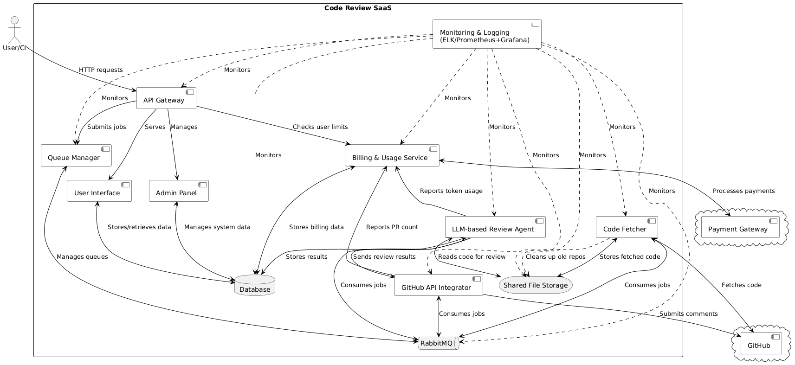

# Code Review SaaS Services Description

## Services

### 1. API Gateway
Entry point for all client requests to the system.

**Interactions**:
- Receives HTTP requests from users and CI systems
- Routes requests to appropriate internal services
- Serves User Interface
- Manages Admin Panel
- Submits jobs to Queue Manager
- Checks user limits with Billing & Usage Service

### 2. Queue Manager
Manages the queue of code review tasks.

**Interactions**:
- Interacts with RabbitMQ to manage job queues
- Receives jobs from API Gateway

### 3. Code Fetcher
Retrieves code from GitHub for review.

**Interactions**:
- Fetches code from GitHub
- Stores fetched code in Shared File Storage
- Consumes jobs from RabbitMQ
- Cleans up old repositories from Shared File Storage

### 4. LLM-based Review Agent
Performs code review using AI models.

**Interactions**:
- Reads code from Shared File Storage
- Consumes review jobs from RabbitMQ
- Stores review results in Database
- Sends review results to GitHub API Integrator
- Reports token usage to Billing & Usage Service

### 5. GitHub API Integrator
Interacts with GitHub API to submit review comments.

**Interactions**:
- Receives review results from LLM-based Review Agent
- Submits comments to GitHub
- Consumes jobs from RabbitMQ
- Reports PR count to Billing & Usage Service

### 6. Database
Stores system data, user information, and review results.

**Interactions**:
- Stores and retrieves data for User Interface and Admin Panel
- Stores review results from LLM-based Review Agent
- Stores billing data for Billing & Usage Service

### 7. Admin Panel
Interface for system administration.

**Interactions**:
- Managed by API Gateway
- Interacts with Database to manage system data

### 8. User Interface
Web interface for users to interact with the service.

**Interactions**:
- Served by API Gateway
- Interacts with Database to store and retrieve user data

### 9. RabbitMQ
Message queue for managing asynchronous tasks.

**Interactions**:
- Manages queues for Queue Manager
- Provides jobs to Code Fetcher, LLM-based Review Agent, and GitHub API Integrator

### 10. Shared File Storage
Stores fetched code repositories.

**Interactions**:
- Receives and stores code from Code Fetcher
- Provides code to LLM-based Review Agent for review
- Cleaned up by Code Fetcher

### 11. Billing & Usage Service
Manages subscriptions, payments, and resource usage tracking.

**Interactions**:
- Stores billing data in Database
- Processes payments through Payment Gateway
- Receives token usage reports from LLM-based Review Agent
- Receives PR count reports from GitHub API Integrator
- Provides user limit information to API Gateway

### 12. Monitoring & Logging (ELK/Prometheus+Grafana)
Monitors and logs system activities and performance.

**Interactions**:
- Monitors all internal services and components

## External Services

### 1. GitHub
Source code hosting platform.

**Interactions**:
- Provides code to Code Fetcher
- Receives comments from GitHub API Integrator

### 2. Payment Gateway
External service for processing payments.

**Interactions**:
- Processes payments for Billing & Usage Service

